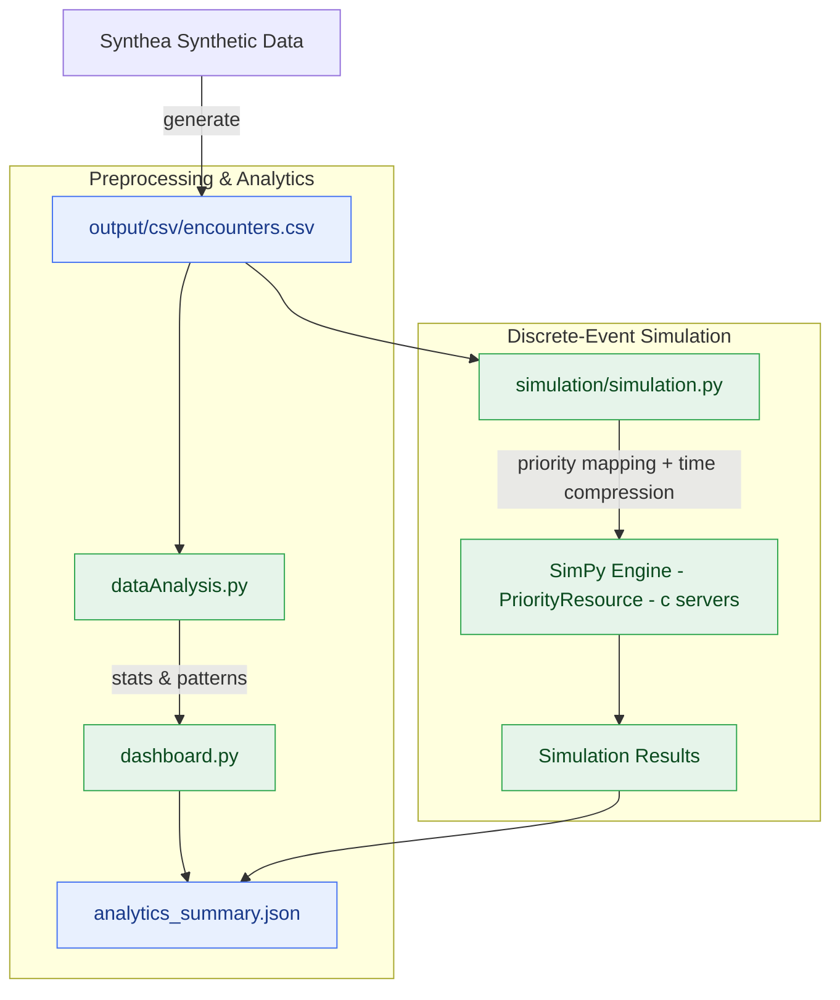
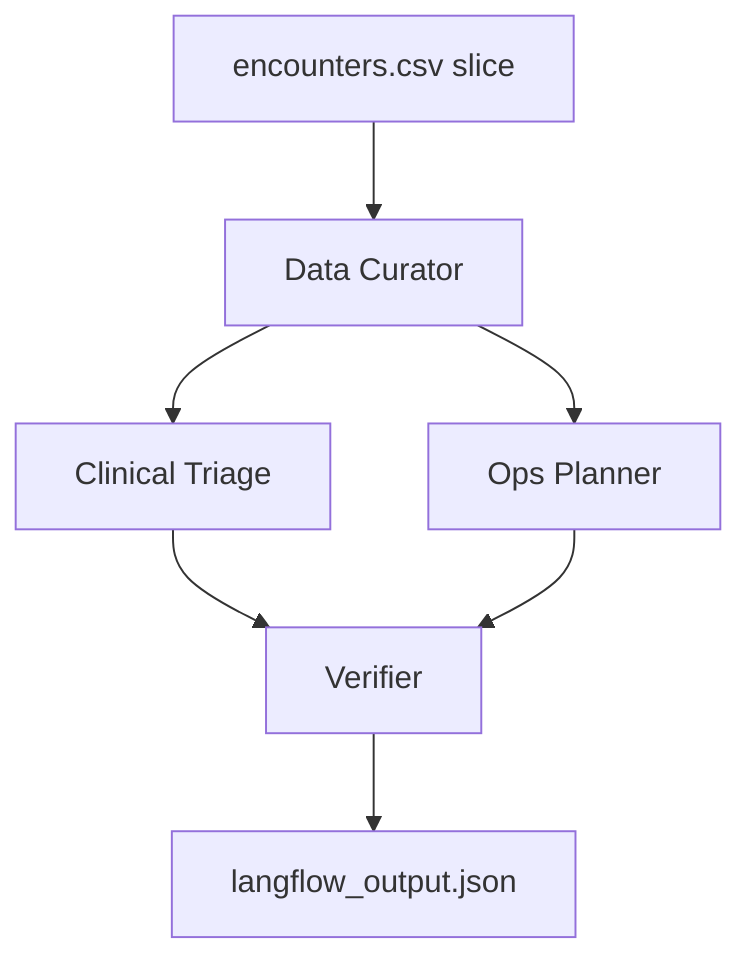

# NHS MOA Triage System

A lightweight workspace to generate synthetic healthcare datasets (FHIR JSON and CSV) using Synthea via Docker, and store them under `output/`.

## What’s Included

- __[data generation]__ Dockerized Synthea run to produce FHIR and CSV under `output/`
- __[queue simulation]__ Discrete-event simulations using `simpy` over real encounter timelines: `utils/queue_simulation.py`
- __[time-compressed MTS sim]__ Manchester Triage System-based priority queue with time compression for sparse data: `simulation/simulation.py`
- __[analytics dashboard]__ Comprehensive analysis and recommendations for capacity planning: `simulation/dashboard.py`
- __[unified entrypoint]__ One command to run analytics then simulation: `python3 -m simulation.main`

## Prerequisites
- Docker installed and running
- Python 3.9+ (local analytics/simulations)
- macOS or Linux shell (Windows users: see note below)

## Project Structure
- `docker-compose.yml` — defines the `synthea` service for dataset generation
- `output/` — generated data will appear here
  - `output/fhir/` — FHIR JSON
  - `output/csv/` — CSV exports
- `utils/queue_simulation.py` — basic SimPy queue model over encounters
- `simulation/simulation.py` — time-compressed MTS priority simulation
- `simulation/main.py` — unified entrypoint: analytics → `analytics_summary.json` → simulation
- `simulation/dataAnalysis.py` — dataset exploration helpers
- `simulation/dashboard.py` — end-to-end analytics and recommendations

## Generate Dataset with Synthea (Docker Compose)
From the project root (`NHS-MOA-Triage-System/`). The compose file is configured to generate 5 patients and export both FHIR and CSV into `output/`.

```bash
# One-off run (recommended)
docker compose run --rm synthea

# Alternatively, start the service (it will run then exit when finished)
docker compose up synthea
```

### Notes
- Default patient count is set via `.env` -> `PATIENT_COUNT=5` and read by `docker-compose.yml`.
- Override the patient count without editing the file by appending args:
  ```bash
  docker compose run --rm synthea -p 100
  ```
  The CSV export flag is already enabled in the service configuration.
- CSV files will be under `output/csv/`, FHIR JSON under `output/fhir/`.
- Windows: Use the same `docker compose` commands in PowerShell or CMD.

## Verify Outputs
After the run completes, you should see files in:
- `output/csv/` (e.g., `patients.csv`, `allergies.csv`, etc.)
- `output/fhir/` (a set of `.json` bundles per patient)

## Simulations & Analytics (Local Python)

Install Python dependencies:

```bash
python -m venv .venv && source .venv/bin/activate
pip install -r requirements.txt
```

- __[Queue simulation]__ using encounter arrival times and service durations:
  ```bash
  python utils/queue_simulation.py --servers=3 --class=emergency --limit=500 --defaultServiceMin=15
  ```
  Outputs JSON with `avg_wait_min`, `avg_time_in_system_min`, `utilization`, etc. See `utils/queue_simulation.py`.

- __[Unified entrypoint]__ Recommended: runs the analytics dashboard, writes `analytics_summary.json`, then runs the simulation using the recommended servers unless overridden.
  ```bash
  # Run analytics then simulation (module form ensures package imports work)
  python3 -m simulation.main

  # Examples
  python3 -m simulation.main --servers=4                 # override server count
  python3 -m simulation.main --compressTo=12hours        # gentler compression
  python3 -m simulation.main --class=emergency           # filter by encounter class
  python3 -m simulation.main --limit=200 --debug         # larger sample + debug logs
  python3 -m simulation.main --plots                     # also save charts to output/plots/
  python3 -m simulation.main --plots --plotsDir=reports/plots  # custom output folder
  ```
  This reads `output/csv/encounters.csv`, prints a comprehensive analytics report, saves a summary to `analytics_summary.json`, and then runs the simulation with the selected parameters.

- __[Time-compressed MTS simulation (direct)]__ You can still run the simulator directly if needed:
  ```bash
  python3 simulation/simulation.py --servers=3 --compressTo=8hours --limit=100 --debug
  ```
  See `simulation/simulation.py` (`ManchesterTriageSystem`, `CompressedMTSSimulation`).

### Plots and visual reports

- Use the `--plots` flag with the unified entrypoint to generate PNG charts summarizing key metrics. Files are saved to `output/plots/`:
 - You can set a custom directory via `--plotsDir <path>`.
  - `patients_per_priority.png` — bar chart of patients by MTS priority
  - `breach_rate_by_priority.png` — breach percentage by priority (if available)
  - `wait_times_by_priority.png` — average and P95 wait times by priority
  - `overall_metrics.png` — overall breach %, average wait, and P95 wait

- Example:
  ```bash
  python3 -m simulation.main --servers=4 --compressTo=8hours --plots --plotsDir=output/plots
  ```
  Plots are produced by `simulation/utils/plotting.py` using seaborn/matplotlib.

- __[Dataset analysis helpers]__ overview stats and parameter suggestions:
  ```bash
  python simulation/dataAnalysis.py
  ```

- __[Comprehensive analytics dashboard]__ prints a full report and writes `analytics_summary.json`:
  ```bash
  python3 simulation/dashboard.py
  ```

## Troubleshooting
- "permission denied" on bind mount: ensure the `output/` folder exists and you have write permissions. If missing, create it:
  ```bash
  mkdir -p output
  ```
- Docker cannot find image: ensure you’re online; Docker will pull `intersystemsdc/irisdemo-base-synthea:version-1.3.4` automatically.

- Module imports error: `ModuleNotFoundError: No module named 'simulation'`
  - Always run the unified entrypoint as a module from the repo root:
    ```bash
    python3 -m simulation.main
    ```
  - Running `python simulation/main.py` may not treat `simulation/` as a package in some environments.

- Data not found error for `encounters.csv`
  - Ensure data exists at `output/csv/encounters.csv`.
  - Path handling in `simulation/dashboard.py` was fixed to avoid `output/output/...`. If you previously saw a doubled path, pull latest and re-run.

## References (selected)

- __SimPy documentation__ — Discrete‑event simulation framework with process interaction and resources: https://simpy.readthedocs.io/en/latest/ 
- __Manchester Triage System (MTS)__ — Peer‑reviewed discussions of waiting times and urgency levels: 
  - BMJ Emergency Medicine Journal: https://emj.bmj.com/content/31/1/13 
  - BMC Emergency Medicine (performance in older patients): https://bmcemergmed.biomedcentral.com/articles/10.1186/s12873-018-0217-y 
- __M/M/c queue (queueing theory)__ — Background on multi‑server queues used for staffing/utilization reasoning: https://en.wikipedia.org/wiki/M/M/c_queue 
- __Synthea__ — Synthetic patient generator used for data: https://github.com/synthetichealth/synthea 

## Simulation Details and Rationale

### Model overview
- __Queueing paradigm__: We simulate a service system where encounters arrive over time with service durations extracted from `START`/`STOP` in `output/csv/encounters.csv`.
- __Engines__: `utils/queue_simulation.py` uses `simpy.Resource` (FIFO) and `simulation/simulation.py` uses `simpy.PriorityResource` for non‑preemptive priorities. See SimPy docs: https://simpy.readthedocs.io/en/latest/
- __Servers__: Parallel capacity `c = --servers`.

### Time compression (for sparse timelines)
Real datasets may span days/months with low density. `simulation/simulation.py` compresses timestamps to a target window (e.g., 8 hours) while preserving ordering and relative gaps. This creates realistic queueing pressure for experimentation without altering the event sequence. The approach maintains causality and relative inter‑arrival structure, which is essential for queue dynamics.

### Manchester Triage System (MTS) priorities
- __Priority classes__: P1–P5 with target maximum waits (e.g., Immediate/Red, Very Urgent/Orange, etc.). In `ManchesterTriageSystem.PRIORITIES` we encode names, color codes, and target waits; assignment uses encounter class plus clinical keywords from `REASONDESCRIPTION`.
- __Rule choice__: We bias toward higher priority (P1/P2) when critical terms are present (e.g., “cardiac arrest”, “stroke”, “chest pain”), moderate (P2/P3) for acute terms (e.g., “pain”, “infection”), and otherwise sample from encounter‑class distributions. This mirrors MTS’s discriminator‑based urgency determination while remaining data‑driven and lightweight for synthetic data.
- __Queue discipline__: Non‑preemptive priority queue via `PriorityResource.request(priority=p)`. Lower numeric priority (P1) is served first when a server frees; service is not interrupted mid‑treatment, aligning with ED practice. Breaches are measured against the target max wait per MTS level.
- __Why MTS__: MTS is widely used across UK EDs and Europe and supported by NHS guidance noting several validated triage systems (MTS, CTAS, ESI) in use in England.
  - NHS England initial assessment guidance: https://www.england.nhs.uk/guidance-for-emergency-departments-initial-assessment/
  - Systematic review on MTS validity: https://pmc.ncbi.nlm.nih.gov/articles/PMC5289484/
  - EMJ before/after MTS study: https://emj.bmj.com/content/31/1/13

### Queueing theory background (staffing intuition)
While results are generated empirically by simulation, capacity recommendations in `simulation/dashboard.py` are informed by classic M/M/c intuition:

- Let λ be average arrival rate, μ be average service rate per server, c be number of servers, and ρ = λ/(cμ) be utilization.
- For an M/M/c with Erlang‑C, the probability an arrival must wait is:

$$
P(\text{wait}) = \frac{\frac{(c\,\rho)^c}{c!\,(1-\rho)}}{\sum\limits_{k=0}^{c-1} \frac{(c\,\rho)^k}{k!} + \frac{(c\,\rho)^c}{c!\,(1-\rho)}}
$$

- The expected waiting time in queue:

$$
W_q = \frac{P(\text{wait})}{c\,\mu - \lambda}
$$

Plain-text fallback (if math blocks don’t render):
```
P(wait) = ((c*rho)^c / (c! * (1 - rho)))
          ------------------------------------------
          sum_{k=0..c-1} (c*rho)^k / k!  +  (c*rho)^c / (c! * (1 - rho))

W_q = P(wait) / (c*mu - lambda)
```

- Expected time in system: `W = W_q + 1/μ`. These formulas are used for rough staffing guidance and validation of simulated behavior (see also Little’s Law `L = λ W`).

References:
- Queueing theory M/M/c summary: https://en.wikipedia.org/wiki/Queueing_theory#M/M/c
- Erlang C formula: https://en.wikipedia.org/wiki/Erlang_(unit)#Erlang_C_formula
- Priority queueing background: https://en.wikipedia.org/wiki/Priority_queueing

## Simulation Architecture (Diagram)



Legend:
- Data source: `output/csv/encounters.csv`
- Analysis pipeline: `simulation/dataAnalysis.py` → `simulation/dashboard.py` → `analytics_summary.json`
- Simulation pipeline: `simulation/simulation.py` → SimPy engine (non‑preemptive priorities, c servers)

### NHS relevance
- __Policy context__: NHS EDs use validated triage systems; MTS is widely adopted across the UK and Europe (see NHS England guidance above).
- __Operational impact__: Modeling non‑preemptive priority queues with MTS targets allows analysis of breach rates by acuity, peak‑period staffing needs, and service‑time variability—key to meeting access targets and improving patient flow.
- __Practical use__: The dashboard highlights peak hours/days, P95 wait times, and recommends staffing buffers at high demand periods. This aligns with ED operations where resource matching to arrival variability is critical.

## Next Steps
- Adjust patient count (`-p N`) to scale datasets.
- Explore additional Synthea flags/modules as needed.
 - Extend priority mapping and calibration in `simulation/simulation.py` using your local clinical policies.
 - Parameterize staffing rules and utilization targets in `simulation/dashboard.py` for scenario testing.

---

## Future Scope: Langflow Mixture of Agents

Build a Langflow pipeline that generates simulation-ready triage and staffing plans using a mixture-of-agents (MoA) design. The simulation then consumes the agent output to run scenarios at scale.

### Approach
- __System prompt agents__
  - __Data Curator Agent__: validates and summarizes `encounters.csv` slices; outputs clean feature signals (arrival bursts, encounterclass mix, service-time priors).
  - __Clinical Triage Agent__: maps encounter text to MTS-like priorities using discriminator keywords and contextual rules; ensures safety defaults.
  - __Ops Planner Agent__: proposes compression window, server counts, and stress-test sets using M/M/c heuristics and policy targets.
  - __Verifier Agent__: checks internal consistency, constraints (e.g., P1 wait=0), and emits JSON conforming to schema.

- __Routing and aggregation__
  - Curator → Triage and Ops run in parallel.
  - Verifier merges results and enforces schema.
  - Optional feedback loop if constraints fail.

### Architecture (Langflow)



### Output schema (consumed by simulation)

```json
{
  "version": "1.0",
  "window": {
    "start": "2020-08-31T02:07:21Z",
    "end": "2020-08-31T23:06:01Z",
    "compress_to": "8hours"
  },
  "priority_mapping": {
    "emergency": {"P1": 0.2, "P2": 0.5, "P3": 0.3},
    "urgentcare": {"P2": 0.3, "P3": 0.5, "P4": 0.2},
    "ambulatory": {"P3": 0.3, "P4": 0.5, "P5": 0.2},
    "outpatient": {"P3": 0.2, "P4": 0.6, "P5": 0.2},
    "wellness": {"P4": 0.4, "P5": 0.6},
    "inpatient": {"P2": 0.2, "P3": 0.6, "P4": 0.2}
  },
  "staffing": {
    "servers": 3,
    "utilization_target": 0.8,
    "stress": [2, 4, 6]
  },
  "constraints": {
    "p1_wait_max_min": 0,
    "p2_wait_max_min": 10,
    "p3_wait_max_min": 60,
    "p4_wait_max_min": 120,
    "p5_wait_max_min": 240
  }
}
```

### How the simulation consumes this
- __File input__: Save Langflow output to `output/langflow_output.json`.
- __Simulation hook__: Extend `simulation/simulation.py` to accept `--config output/langflow_output.json`.
  - Parse `window` to select and compress time slice.
  - Use `priority_mapping` to sample per-encounter priority.
  - Apply `staffing.servers` to set SimPy `PriorityResource` capacity.
  - Validate against `constraints` and log breaches.

Minimal CLI example (planned):
```
python simulation/simulation.py --config=output/langflow_output.json --limit=200
```

### Scaling to hundreds of patients quickly
- __Batching__: Chunk encounters by day or hour; process each chunk through Langflow in parallel; concatenate JSONs before simulation.
- __Asynchronous requests__: Use Langflow REST with async workers and a job queue; backoff on rate limits.
- __Deterministic prompts__: Fix temperature and use few-shot exemplars to minimize retries.
- __Caching__: Hash inputs (text, encounterclass mix); reuse prior agent outputs for identical or similar chunks.
- __Lightweight paths__: Only send minimal features (class, key terms, times) to agents; keep bulk data local.
- __Vector prefilter__: Embed reasons/descriptions once; retrieve nearest exemplars to guide Triage agent without large prompts.
- __Fail-open rules__: If an agent times out, fall back to policy defaults (e.g., emergency→P2) so the simulation proceeds.

This MoA pipeline enables rapid, policy-aligned scenario generation while preserving the discrete-event simulation as the single source of truth for system dynamics.
